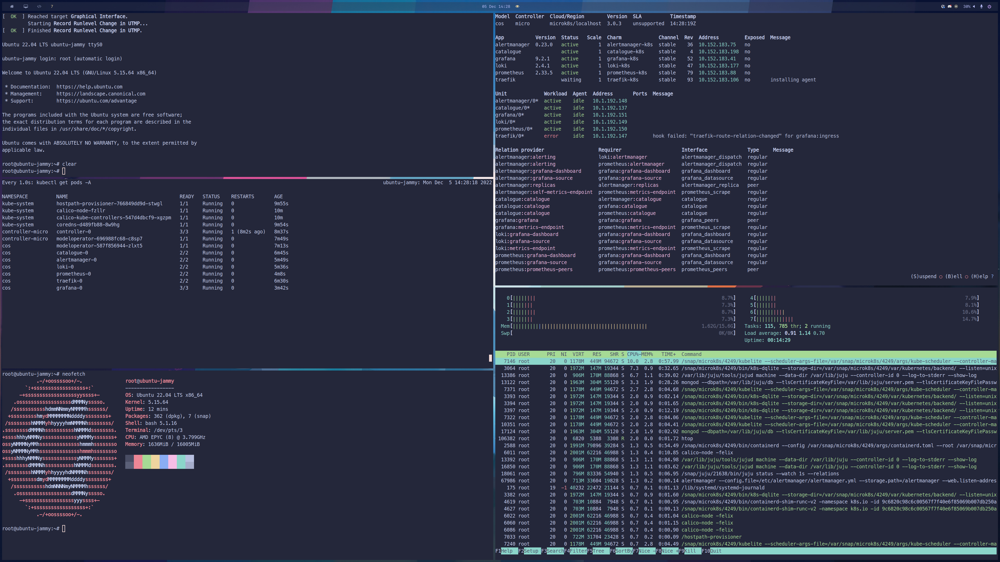

# Ubuntu on Firecracker

The purpose of this project was to explore running Ubuntu with [Firecracker] as a general purpose
development machine. This is obviously not what Firecracker was developed for, but it was an
opportunity to learn a little about it!

At present, this project provides some basic automation for building a kernel image and rootfs that
firecracker can boot.

I took a lot of influence from [ubuntu-firecracker] by [@bkleiner] in the making of this project.

Using this approach, I was able to deploy the [Canonical Observability Stack] with [Juju] on
[MicroK8s] inside a Firecracker VM:



## Prerequisites

Before you can use or test this project, you'll need the following installed on your machine:

- [docker]
- [firecracker]
- [firectl]
- [dnsmasq]

Note that dnsmasq is only required if you want to run DHCP/DNS for your VMs rather than statically
address them

## Limitations and caveats

This project is heavily tailored to my own use currently. In particular, the rootfs will contain my
SSH key by default! You can change that in `./builder-image/script/provision.sh`. In a future
update, I'm aiming to enable `cloud-init` support for the VMs and will remove this!

## Quick start

You can start the project on a clean machine with `./demo.sh`. This will first build an OCI image,
which is then in turn used to build and kernel and rootfs image. Once those images are built, the
demo script will start a VM with some default config.

By default, the [config] looks like so:

```bash
# Some configuration for the VM
FC_CPUS="${FC_CPUS:-8}"
FC_MEMORY="${FC_MEMORY:-16386}" # 16GB
FC_DISK="${FC_DISK:-20G}"
FC_HOSTNAME="${FC_HOSTNAME:-dev}"

# Uncomment this line to use a bridge interface and enable DHCP for the VM
# FC_DHCP="${FC_DHCP:-true}"
```

Once you've run `./demo.sh`, you'll be dropped into a serial console logged in as root. To exit or
shutdown the VM, type `reboot`.

## HACKING

### Building components

If you need to rebuild any of the individual components, you can use the included Makefile:

```
# Clone the repository
git clone https://github.com/jnsgruk/firecracker-ubuntu
cd firecracker-ubuntu

# (Optional) Build the builder container image
# If you omit this step the image will be pulled from Docker Hub
make oci

# Build a kernel image
make kernel

# Build a rootfs
make rootfs
```

### Kernel configurations

Included with this repo are two kernel config files:

- [kernel-config-minimal]
- [kernel-config-jammy-modified]

The former is a very minimal config that has just the features I needed for testing out running
LXD, [MicroK8s] and [Juju].

The latter was created by pulling the kernel config from the latest Ubuntu 22.04 cloud image and
making some minor modifications so that it would boot in this setup, so is more representative of a
"proper" Ubuntu kernel.

There is a symlink at `./config/kernel-config` that points to the minimal version by default. To
build the Ubuntu kernel, just remove the symlink and recreate it to point to the kernel config you
wish to use.

You can also use the OCI image to run `make menuconfig` to customise a config:

```bash
docker run \
    --rm \
    -v $(pwd)/build:/build \
    -v $(pwd)/config:/config \
    --entrypoint /bin/bash \
    -it jnsgruk/firecracker-builder

cd /build/kernel/linux-source-5.15.0/
# Run menuconfig, make any changes you need to
make menuconfig
# Copy the updated config into location in the config directory
cp /build/kernel/linux-source-5.15.0/.config /config/kernel-config

# Now exit the container and run the kernel build to use the new config
```

## TODO

- [x] Figure out how to run DHCP on a tap interface
- [x] Enable the use of standard Ubuntu cloud images
- [ ] Enable cloud-init support
- [ ] Add support for customising kernel and rootfs build
- [ ] Wrap firectl to run VMs in the background

[@bkleiner]: https://github.com/bkleiner
[canonical observability stack]: https://charmhub.io/topics/canonical-observability-stack
[config]: ./default.conf
[dnsmasq]: https://thekelleys.org.uk/dnsmasq/doc.html
[docker]: https://docs.docker.com/desktop/install/linux-install/
[firecracker]: https://github.com/firecracker-microvm/firecracker
[firectl]: https://github.com/firecracker-microvm/firectl
[juju]: https://juju.is
[kernel-config-minimal]: ./config/kernel-config-minimal
[kernel-config-jammy-modified]: ./config/kernel-config-jammy-modified
[microk8s]: https://microk8s.io
[ubuntu-firecracker]: https://github.com/bkleiner/ubuntu-firecracker
